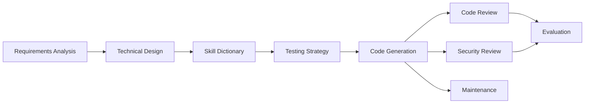

# development-flow-guidelines

Open-source guidance for AI-assisted coding work across multiple editors and agents.

[](https://github.com/Thomas520TOM/development-flow-guidelines/actions/workflows/validate.yml)
[](scripts/validate.py)
[](LICENSE)
[](platforms/)

`development-flow-guidelines` packages a full lifecycle system for code-related tasks: requirements analysis, technical design, skill lookup, testing strategy, code generation, code review, security review, maintenance, evaluation, logging, context recovery, and extensibility.

## Highlights

- Multi-platform by design: Codex, Claude Code, opencode, Cursor, and GitHub Copilot all have first-class adapters.
- Lifecycle aware: work flows from idea to implementation through explicit stages, gates, and validation.
- Modular and auditable: every module has frontmatter, dependencies, outputs, and gate checks.
- Release ready: validation covers reference reachability, dependency closure, token budgets, and lifecycle coverage.
- Template friendly: the repo works as a reusable instruction system, not a one-off prompt dump.

## Why It Exists

Most coding-assistant setups are either too shallow to scale or too rigid to adapt. This project sits in the middle:

- enough structure to keep the assistant consistent
- enough modularity to load only what is needed
- enough validation to keep the repository trustworthy

The result is a practical skill system that can be shared, extended, and published like a serious open-source project.

## What You Get

| Area | What It Covers |
|------|----------------|
| Stage routing | A single entry point in [SKILL.md](SKILL.md) and a standard development flow |
| Decision support | A skill dictionary with technology selection matrices |
| Quality gates | Testing strategy, code review, and security review before work is considered complete |
| Recovery | Context management, error recovery, and progress tracking |
| Extensibility | A documented extension interface and hook model |
| Platform support | Dedicated adapters for the supported coding environments |

## How It Works



The system separates three layers:

1. Discovery: lightweight metadata for intent detection.
2. Activation: the full rule set for the active module.
3. Execution: deeper references, checklists, and platform-specific guidance.

## Supported Platforms

| Platform | Adapter | Notes |
|----------|---------|-------|
| Codex | `agents/openai.yaml` | Root skill package support |
| Claude Code | `platforms/claude-code/` | Project-level or user-level install |
| opencode | `platforms/opencode/` | Uses `AGENTS.md` as discovery |
| Cursor | `platforms/cursor/rules/` | Always-on and glob-based rule loading |
| GitHub Copilot | `platforms/github-copilot/instructions.md` | Single-file instructions |

## Quick Start

If you want to use the repository as a skill package:

```powershell
Expand-Archive -Path ".\development-flow-guidelines.zip" -DestinationPath "C:\Users\<username>\.codex\skills\development-flow-guidelines" -Force
```

For Claude Code:

```bash
cp -r . ~/.claude/skills/development-flow-guidelines/
cp platforms/claude-code/CLAUDE.md <project-root>/CLAUDE.md
```

For opencode:

```bash
cp platforms/opencode/SKILL.md ~/.config/opencode/skills/development-flow-guidelines/SKILL.md
mkdir -p .opencode/skills/development-flow-guidelines
cp platforms/opencode/SKILL.md .opencode/skills/development-flow-guidelines/SKILL.md
```

## Validation

Run the repository validator before publishing changes:

```powershell
python scripts/validate.py
```

It checks:

- frontmatter completeness
- reference reachability
- gate closure
- circular dependencies
- token budget consistency
- lifecycle coverage
- release surface presence

## Repository Map

| Path | Purpose |
|------|---------|
| [SKILL.md](SKILL.md) | Entry point and stage router |
| [02-skill-dictionary/index.md](02-skill-dictionary/index.md) | Technology selection matrices and implementation guidance |
| [03-project-setup/](03-project-setup/) | Requirements analysis and technical design |
| [05-log-memory/](05-log-memory/) | Append-only logs and templates |
| [07-testing-strategy/rules.md](07-testing-strategy/rules.md) | TDD and coverage gate |
| [08-code-review/rules.md](08-code-review/rules.md) | Structured code review rubric |
| [09-security-review/rules.md](09-security-review/rules.md) | Security review rubric |
| [platforms/](platforms/) | Platform adapters |
| [scripts/validate.py](scripts/validate.py) | Repository validation script |
| [AGENTS.md](AGENTS.md) | opencode discovery layer |

## Contributing

When adding or changing a module:

1. Keep the module frontmatter complete.
2. Update the relevant platform adapter if behavior changes.
3. Run `python scripts/validate.py`.
4. Keep the README and module index aligned with the actual file tree.

## Notes

- Discovery, activation, and execution are intentionally separate.
- Dynamic project logs belong in instance directories, not inside the template itself.
- The `scripts/` folder is reserved for repository automation and validation.

## License

MIT License. See [LICENSE](LICENSE).
