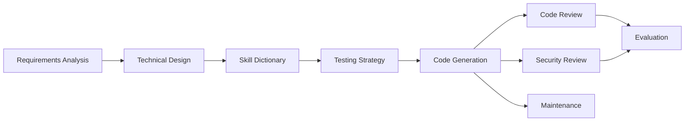

# coding-guidelines

Open-source, multi-platform guidance for AI-assisted coding work.

This repository packages a complete lifecycle system for code-related tasks: requirements analysis, technical design, skill lookup, testing strategy, code generation, code review, security review, maintenance, evaluation, logging, context recovery, and extensibility.

## What This Project Is

`coding-guidelines` is a modular instruction set for coding agents. It provides:

- a consistent stage model for working from idea to implementation
- platform adapters for Codex, Claude Code, opencode, Cursor, and GitHub Copilot
- a skill dictionary for common implementation decisions
- validation rules for module completeness and reference integrity
- system-wide modules for logging, recovery, progress tracking, and extension hooks

The repository is designed as a template-style skill system. The core rules are in the top-level markdown files, while platform-specific adapters live under `platforms/`.

## Repository Layout

| Path | Purpose |
|------|---------|
| [SKILL.md](SKILL.md) | Entry point and stage router |
| [02-skill-dictionary/index.md](02-skill-dictionary/index.md) | Technology selection matrices and implementation guidance |
| [03-project-setup/](03-project-setup/) | Requirements analysis and technical design |
| [07-testing-strategy/rules.md](07-testing-strategy/rules.md) | TDD and coverage gate |
| [08-code-review/rules.md](08-code-review/rules.md) | Structured code review rubric |
| [09-security-review/rules.md](09-security-review/rules.md) | Security review rubric |
| [05-log-memory/](05-log-memory/) | Append-only logs and templates |
| [platforms/](platforms/) | Platform adapters |
| [scripts/validate.py](scripts/validate.py) | Repository validation script |
| [AGENTS.md](AGENTS.md) | opencode discovery layer |

## Supported Platforms

| Platform | Adapter | Notes |
|----------|---------|-------|
| Codex | `agents/openai.yaml` | Root skill package support |
| Claude Code | `platforms/claude-code/` | Project-level or user-level install |
| opencode | `platforms/opencode/` | Uses `AGENTS.md` as discovery |
| Cursor | `platforms/cursor/rules/` | Always-on and glob-based rule loading |
| GitHub Copilot | `platforms/github-copilot/instructions.md` | Single-file instructions |

## Core Flow



## Validation

Run the repository validator before publishing changes:

```powershell
python scripts/validate.py
```

The validator checks:

- frontmatter completeness
- reference reachability
- gate closure
- circular dependencies
- token budget consistency
- lifecycle coverage
- release surface presence

## Installation

### Codex

Copy the repository into the Codex skills directory:

```powershell
Expand-Archive -Path ".\coding-guidelines.zip" -DestinationPath "C:\Users\<username>\.codex\skills\coding-guidelines" -Force
```

### Claude Code

```bash
cp -r . ~/.claude/skills/coding-guidelines/
cp platforms/claude-code/CLAUDE.md <project-root>/CLAUDE.md
```

### opencode

```bash
cp platforms/opencode/SKILL.md ~/.config/opencode/skills/coding-guidelines/SKILL.md
mkdir -p .opencode/skills/coding-guidelines
cp platforms/opencode/SKILL.md .opencode/skills/coding-guidelines/SKILL.md
```

### Cursor

```bash
cp platforms/cursor/rules/*.mdc <project-root>/.cursor/rules/
```

### GitHub Copilot

```bash
cp platforms/github-copilot/instructions.md <project-root>/.github/copilot-instructions.md
```

## Contributing

When adding or changing a module:

1. Keep the module frontmatter complete.
2. Update the relevant platform adapter if behavior changes.
3. Run `python scripts/validate.py`.
4. Keep the README and module index aligned with the actual file tree.

## Notes

- The repo intentionally separates discovery, activation, and execution layers.
- Dynamic project logs belong in instance directories, not inside the template itself.
- The `scripts/` folder is reserved for repository automation and validation.

## License

MIT License. See [LICENSE](LICENSE).
